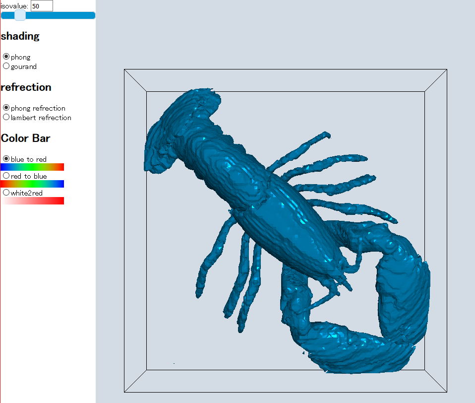
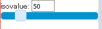
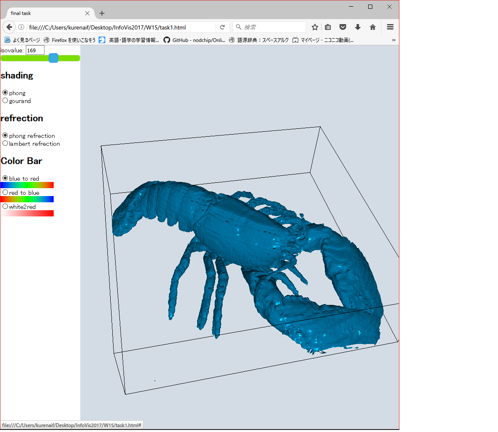
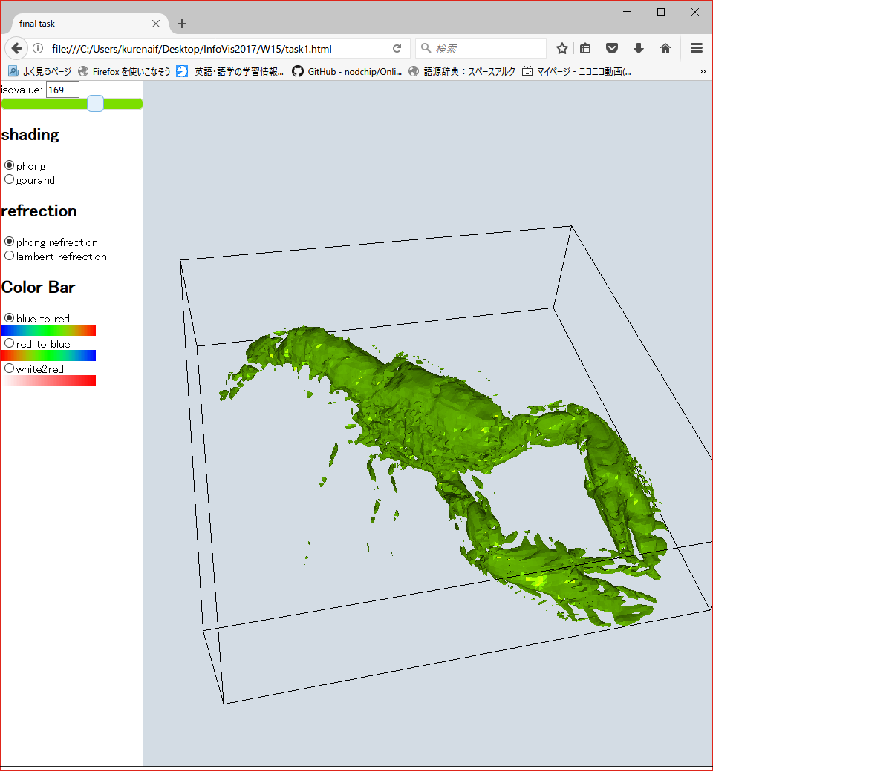
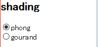
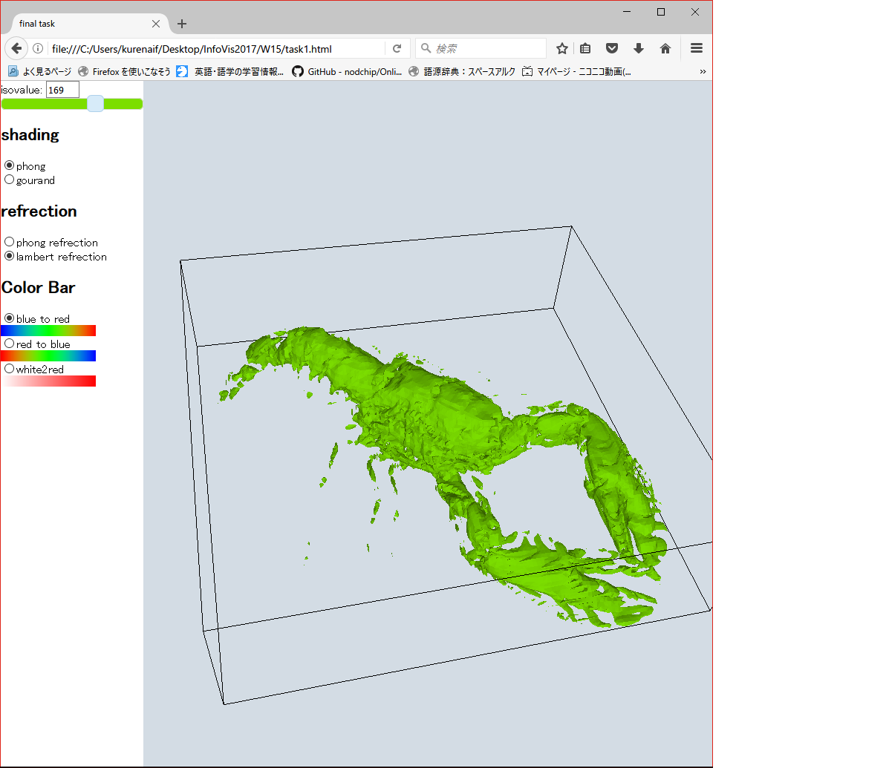
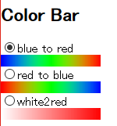
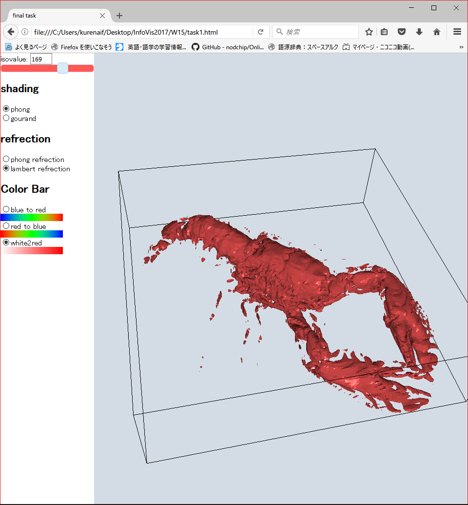

# 概要
以下の図に示すように，

* isovalue
* shading
* refrection
* Color Bar

を選択し，それにあった出力をするプログラムである．
jQueryを用いてバーの変化やラジオボタンの選択などのイベントをリアルタイムで取得し，Applyボタンレスなデザインにした．

Controller部(画面左)とViewer部(画面右)の分割に若干のバグがありレンダリングが崩れる時があるが，更新すると治る．


# UIの概要

## Isovalue


Isovalueの値の変更の仕方は二通りで，

1. isovalue: のtextboxの値を直接編集する
2. バーを動かす

で可能である．

#### isovalueのtextboxの値を直接編集する方法
isovalueの値は一桁一桁入力するたびに再描画がかかると時間がかかるため，テキストボックスからカーソルが離れた瞬間に反映されるようになっている．

#### バーを動かす
jQueryのsliderで実装している． バーを離したタイミングで更新がされる．
バーの背景色はisovalueに対応した色となっており，その色がザリガニの色に反映される．
バーの背景色はバーを離さなくても，スライダーを動かしている状態で色が変化し，そのisovalueに対応した色を教えてくれる．

**バーをドラックしている時**

**バーを話した時**


## Shading


shadingの設定を行うことができる．phongはphong shading, gourand は gourand shadingを表す．

ラジオボタンが押されたときに変更が反映される．

## refrection


shadingの設定を行うことができる．phongはphong refrection, lambert は lambert refrectionを表す．

ラジオボタンが押されたときに変更が反映される．

**phong refrection**

**lambert refrection**


## Color Bar


color_barの設定を行う． 選択肢としては，授業で取り扱った blue to red, white to redに加えてred to blueを追加した

ラジオボタンを選択した時に自動的に反映が行われる(isovalueの下のバーの色も反映される).

**color_barを変更した例**


# その他実装について

isovalueの反映，再描画については単純にsceneからモデルを一度消して再生成をしている．(そのため時間がかかる)
```
screen.scene.remove(surfaces);
surfaces.geometry.dispose();
surfaces.material.dispose();
```
`screen.scene.remove()`のみでもモデルの削除はできるが，これだとキャッシュに残り続けるので
`surfaces.geometry.dispose()`と`surfaces.material.dispose()`を読んで完全に削除するようにしている．